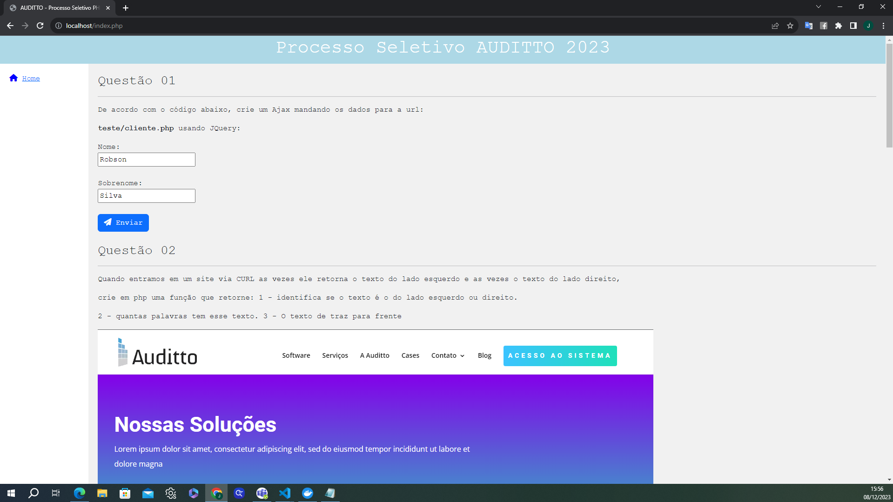
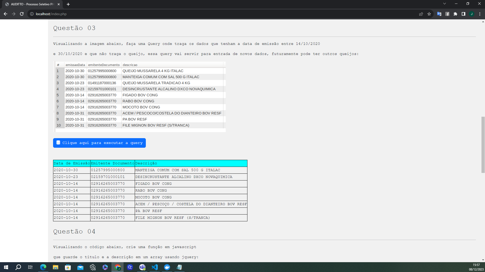
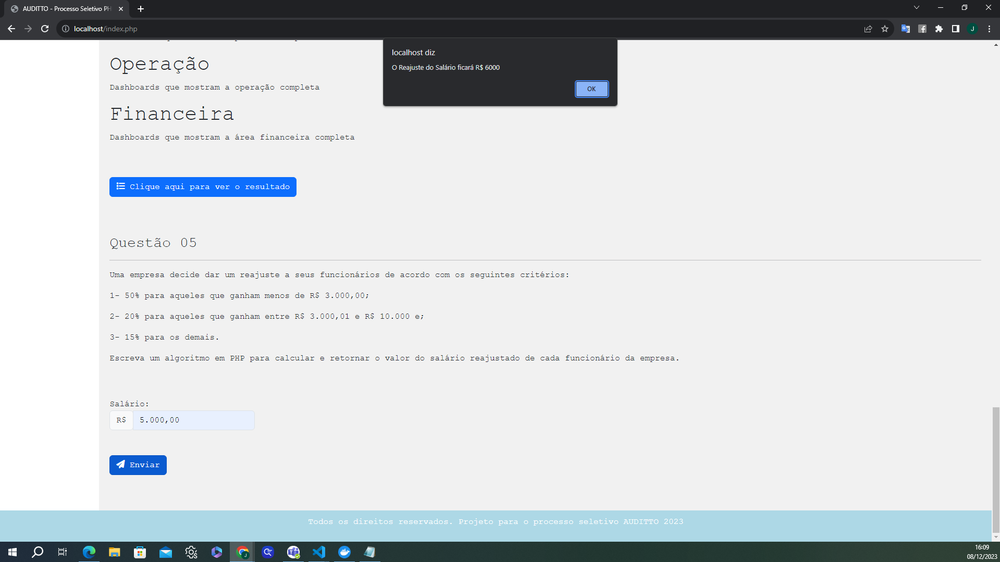

# Processo Seletivo AUDITTO 2023

Projeto construído utilizando PHP 8.0.2, MySQL 8.0, Nginx, Docker, Bootstrap, FontAwesome e jQuery. 
Apliquei conceitos de código limpo com o design pattern MVC. 
Para rodar o projeto em seu ambiente é necessário ter o docker instalado. 
Com o Docker instalado rode o comando: docker-compose up -d 
Acesse no navegador dessa maneira: https://localhost/

# TELAS DO PROJETO

